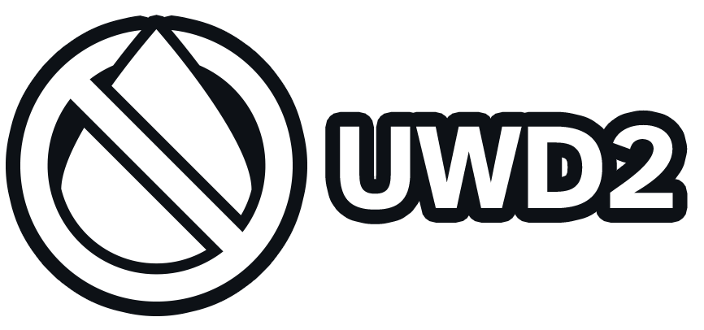

# 

# Universal Watermark Disabler 2

Created by [Melody](https://reticivis.net/)

Inspired by [Universal Watermark Disabler](https://github.com/pr701/universal-watermark-disabler)
by [Painter701](https://github.com/pr701)

Written in [Rust](https://www.rust-lang.org/)

## What is UWD2?

UWD2 removes that pesky watermark in the corner of Windows Insider builds, as well as other similar types of watermarks.

## How to use it?

Just run the exe file in the [releases tab](https://github.com/reticivis-net/uwd2/releases) and watch the watermark
vanish before your eyes! For best results, add UWD2
as [a startup program](https://support.microsoft.com/en-us/windows/add-apps-to-the-startup-page-in-settings-3d219555-bc76-449d-ab89-0d2dd6307164).

## Some disclaimers

### **UWD2 DOES NOT REMOVE THE "ACTIVATE WINDOWS" WATERMARK!!!** UWD2 is for the insider beta watermark.

**UWD2 DOES NOT persist between explorer.exe or system restarts**. [See why below](#how-does-it-work). For best results,
add UWD2
as [a startup program](https://support.microsoft.com/en-us/windows/add-apps-to-the-startup-page-in-settings-3d219555-bc76-449d-ab89-0d2dd6307164).

UWD2 requires an internet connection on first run and between some system updates. [See why below](#how-does-it-work).

UWD2 only works on x86 based CPUs, i.e., not ARM. [See why below](#how-does-it-work).

UWD2 has only been tested on Windows insider beta watermarks. It may work on other similar watermark such as "test
mode", but these are untested.

## How does it work?

UWD2 takes an entirely different approach than the original UWD.
Using [WinDbg](https://learn.microsoft.com/en-us/windows-hardware/drivers/debugger/), I found that inside shell32.dll
there is a function called `CDesktopWatermark::s_DesktopBuildPaint`. This function is what paints the watermark on the
desktop. Using this knowledge, UWD2:

- downloads debugging symbols from microsoft (this is why UWD2 needs an internet connection. UWD2 also caches these
  locally)
- Uses those symbols to find the memory location of `CDesktopWatermark::s_DesktopBuildPaint`
- Inserts a `ret` (return) instruction (this is why UWD2 only works on x86) into the memory of the running
  explorer.exe (this is why UWD2 does not persist) at the position of the `CDesktopWatermark::s_DesktopBuildPaint`
  function, causing the function's code to never execute.